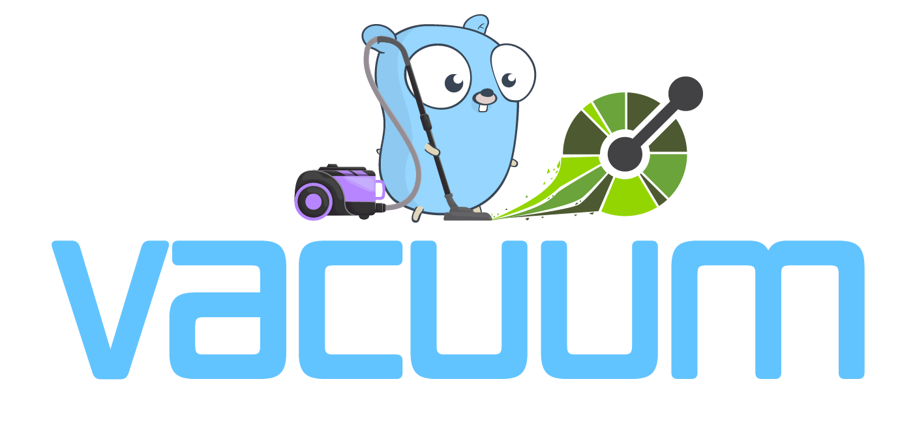
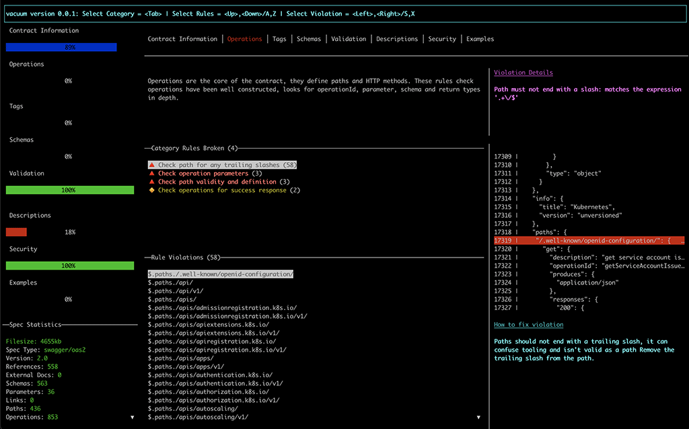

# vacuum - The world's fastest OpenAPI & Swagger linter.


[](https://codecov.io/gh/daveshanley/vacuum)
[](https://goreportcard.com/report/github.com/daveshanley/vacuum)

An **ultra-super-fast**, lightweight OpenAPI linter and quality checking tool, written in golang and inspired by [Spectral](https://github.com/stoplightio/spectral).

It's also compatible with existing [Spectral](https://github.com/stoplightio/spectral) rulesets.

---

> **vacuum can suck all the lint of a 5mb OpenAPI spec in about 250ms.**

Designed to reliably lint OpenAPI specifications, **very, very quickly**. Including _very large_ ones. Spectral can be quite slow
when used as an API and does not scale for enterprise applications.

Vacuum will tell you what is wrong with your spec, why, where and how to fix it. 

Vacuum will work at scale and is designed as a CLI (with a UI) and a library to be consumed in other applications.

### Dashboard

vacuum comes with an interactive dashboard (`vacuum dashboard <your-openapi-spec.yaml>`) allowing you to explore
rules and violations in a console, without having to scroll through thousands of results.



### HTML Report

vacuum can generate an easy to navigate and understand HTML report. Like the dashboard
you can explore broken rules and violations, but in your browser.

No external dependencies, the HTML report will run completely offline.


---

If you want to try out vacuum in its **earliest stages**

> Please be warned, this is _early_ code. I am actively working on it.
>> **_Supports OpenAPI Version 2 (Swagger) and Version 3+_**

You can use either **YAML** or **JSON** vacuum supports both.

## Check out the code

```
git clone https://github.com/daveshanley/vacuum.git
```
### Change directory into `vacuum`

```
cd vacuum
```

## Build the code

```
go build vacuum.go
```

## Run the code

```
./vacuum lint <your-openapi-spec.yaml>
```

## Running vacuum via Docker

vacuum is available as a container, you can pull the image from
[Docker Hub](https://hub.docker.com/repository/docker/dshanley/vacuum/general)

```
docker pull dshanley/vacuum
```

or you can pull it from [Github packages](https://github.com/daveshanley/vacuum/pkgs/container/vacuum).

```
docker pull ghcr.io/daveshanley/vacuum:latest
```

To run, just add `docker dshanley/vacuum` as your command, like so

```
docker dshanley/vacuum lint <your-openapi-spec.yaml>
```

---
> 👉 **Please note, the flags and commands below will change as the experience is refined.** 👈
---

## Build an interactive HTML report 

```
./vacuum html-report <your-openapi-spec.yaml | vacuum-report.json.gz> <report-name.html>
```

You can replace `report-name.html` with your own choice of filename. Open the report
in your favorite browser and explore the results. 


## See full linting report 

```
./vacuum lint -d <your-openapi-spec.yaml>
```

## See full linting report with inline code snippets

```
./vacuum lint -d -s <your-openapi-spec.yaml>
```

## See just the linting errors

```
./vacuum lint -d -e <your-openapi-spec.yaml>
```

## See just a specific category of report


```
./vacuum lint -d -c schemas <your-openapi-spec.yaml>
```

The options here are:

- `examples`
- `operations`
- `information`
- `descriptions`
- `schemas`
- `security`
- `tags`
- `validation`

## Generate a Spectral compatible report

If you're already using Spectral JSON reports, and you want to use vacuum instead, use the `spectral-report` command

```
./vacuum spectral-report <your-openapi-spec.yaml> <report-output-name.json>
```

The report file name is _optional_. The default report output name is `vacuum-spectral-report.json`


## Generate a `vacuum report`

Vacuum reports are complete snapshots in time of a linting report for a specification. These reports can be 'replayed' 
back through vacuum. Use the `dashboard` or the `html-report` commands to 'replay' the report and explore the results
as they were when the report was generated.

```
./vacuum report -c <your-openapi-spec.yaml> <report-prefix>
```

The default name of the report will be `vacuum-report-MM-DD-YY-HH_MM_SS.json`. You can change the prefix by supplying
it as the second argument to the `report` command. 

Ideally, **you should compress the report using `-c`**. This shrinks down the size significantly. vacuum automatically
recognizes a compressed report file and will deal with it automatically when reading.

> When using compression, the file name will be `vacuum-report-MM-DD-YY-HH_MM_SS.json.gz`. vacuum uses gzip internally.

---

## Try out the dashboard

This is an early, but working console UI for vacuum. The code isn't great, it needs a lot of clean up, but
if you're interested in seeing how things are progressing, it's available.

```
./vacuum dashboard <your-openapi-spec.yaml | vacuum-report.json.gz>
```

---
## Supply your own Spectral ruleset

If you're already using Spectral and you have your own [custom ruleset](https://meta.stoplight.io/docs/spectral/e5b9616d6d50c-custom-rulesets#custom-rulesets),
then you can use it with Vacuum! 

The `lint`, `dashboard` and `spectral-report` commands all accept a `-r` or `--ruleset` flag, defining the path to your ruleset file.

### Here are some examples you can try

**_All rules turned off_**
```
./vacuum lint -r rulesets/examples/norules-ruleset.yaml <your-openapi-spec.yaml>
```

**_Only recommended rules_**
```
./vacuum lint -r rulesets/examples/recommended-ruleset.yaml <your-openapi-spec.yaml>
```

**_Enable specific rules only_**
```
./vacuum lint -r rulesets/examples/specific-ruleset.yaml <your-openapi-spec.yaml>
```

**_Custom rules_**
```
./vacuum lint -r rulesets/examples/custom-ruleset.yaml <your-openapi-spec.yaml>
```

**_All rules, all of them!**
```
./vacuum lint -r rulesets/examples/all-ruleset.yaml <your-openapi-spec.yaml>
```

---

Let me know what you think.

> Logo gopher is modified, originally from [egonelbre](https://github.com/egonelbre/gophers)